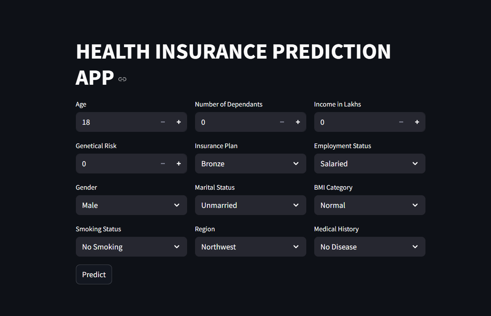

# HEALTH-PREMIUM-PREDICTOR       

# 💡 Health Premium Predictor

Predicting health insurance premium based on personal and lifestyle information using machine learning.




---

## 🚀 Motivation

Rising healthcare costs make it critical to accurately estimate health insurance premiums. Insurance companies, agents, and customers benefit from personalized premium predictions. This project uses historical data and machine learning to create a predictive system, reducing manual estimation errors and enhancing accessibility.

---

## 📂 Dataset Information

Although the dataset link is unavailable, the model was trained on a structured dataset with the following features:

- `Age`
- `Gender`
- `Region`
- `Marital_status`
- `Number_Of_Dependants`
- `BMI_Category`
- `Smoking_Status`
- `Employment_Status`
- `Income_Level`
- `Income_Lakhs`
- `Medical_History`
- `Insurance_Plan`
- `Annual_Premium_Amount` *(Target Variable)*

An additional feature `genetical_risk` was engineered from `Medical_History` to enhance prediction accuracy.

---

## 🛠️ Tech Stack & Tools

- Python
- NumPy, Pandas
- Matplotlib, Seaborn
- Scikit-learn
- XGBoost
- Streamlit

---

## 🧹 Data Preprocessing

The following steps were applied:

- ✅ **Outlier Detection**: Boxplots were used to visualize outliers.
- ✅ **Outlier Handling**: Extremely high incomes were clipped using:

```python
quantile_threshold = df.income_lakhs.quantile(0.999)
df = df[df.income_lakhs < quantile_threshold]
```

- ✅ **Feature Engineering**: `genetical_risk` created from `Medical_History`.
- ✅ **Encoding**: Label Encoding for categorical variables.
- ✅ **Scaling**: StandardScaler used for numerical features.

---

## 🤖 Models Tried

- Linear Regression
- Ridge Regression
- XGBoost Regressor (Final Model)

### ✅ Final Model: XGBoost Regressor
With tuned hyperparameters:

```python
model = XGBRegressor(
    colsample_bytree=0.9,
    gamma=0.2,
    learning_rate=0.07,
    max_depth=4,
    n_estimators=150,
    subsample=0.8,
    random_state=42
)
```

---

## 📈 Results

The final model (XGBoost) outperformed others on training and test data, capturing complex nonlinear relationships in premium prediction.

---

## 🌐 Streamlit App

Try the app here:  
🔗 **[Health Premium Predictor Web App](https://health-premium-predictor-by-shiwan.streamlit.app)**

---

## 🖼️ App Screenshot


---

## 🧠 Professional Use Case

This model can be deployed in:

- 🏥 Insurance company portals for real-time quote generation.
- 👥 Agent tools to advise clients.
- 📈 Financial analysis apps for premium estimations.

---

## 🚧 Future Improvements

- Improve accuracy with more diverse datasets.
- Add SHAP or LIME interpretability.
- Add REST API for wider deployment.

---

## 👨‍💻 Author

**Shiwan Mangate**  
B.Tech in Artificial Intelligence  
NIT Rourkela  
🔗 [GitHub](https://github.com/shiwan-mangate) | [LinkedIn](https://www.linkedin.com/in/shiwan-mangate-4568a9375)
